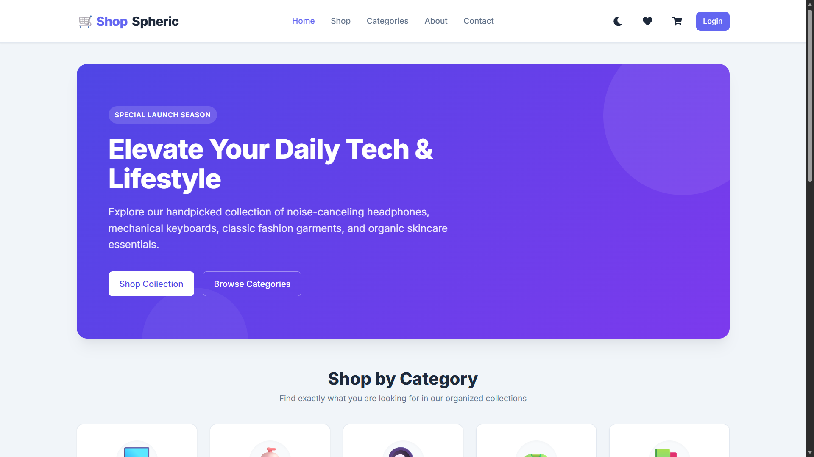
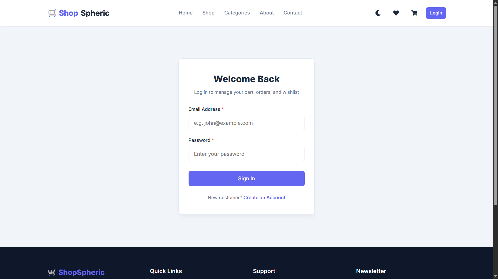
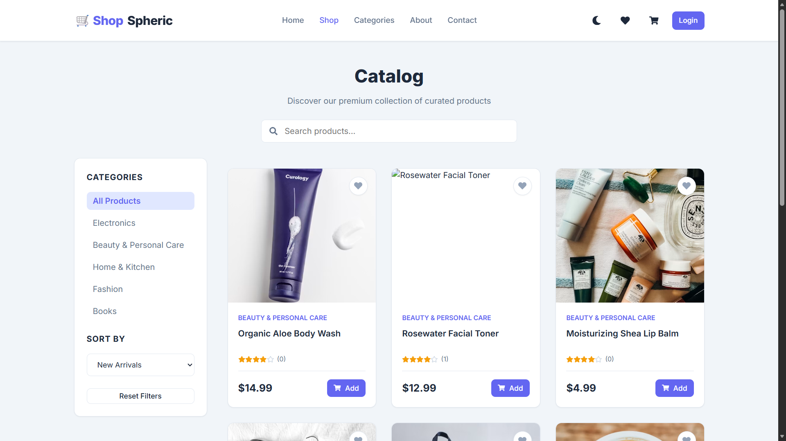
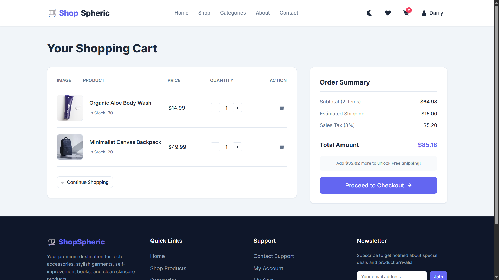
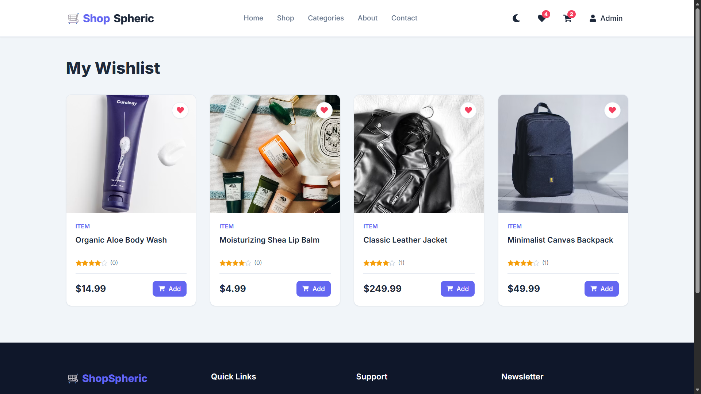
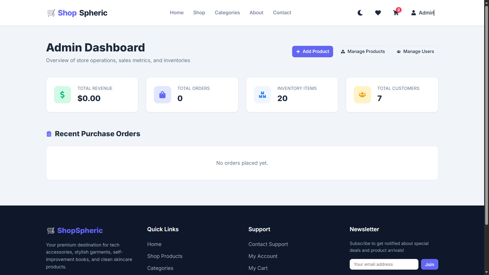

# 🛒 ShopSpheric | Full Stack MERN E-Commerce Application

ShopSpheric is a full-stack MERN (MongoDB, Express.js, React.js, Node.js) e-commerce web application that provides a complete online shopping experience. It features secure JWT authentication, product browsing, shopping cart, wishlist, order management, and an admin dashboard. The application is deployed using Vercel (Frontend), Render (Backend), and MongoDB Atlas (Database).

---

## 🌐 Live Demo

**Frontend:** https://shopspheric-ecommerce-app-pearl.vercel.app

**Backend API:** https://shopspheric-backend.onrender.com

---

## ✨ Features

### 👤 Customer Features

- User Registration & Login
- Secure JWT Authentication
- Browse Products
- Search Products
- Product Categories
- Shopping Cart
- Wishlist Management
- Place Orders
- Responsive User Interface
- Dark & Light Theme Support

### 🔑 Admin Features

- Admin Authentication
- Product Management
- Category Management
- Order Management
- User Management

---

## 🛠 Tech Stack

### Frontend

- React.js
- Vite
- React Router DOM
- Axios
- Context API
- CSS3

### Backend

- Node.js
- Express.js
- MongoDB Atlas
- Mongoose
- JWT Authentication
- bcrypt.js
- CORS

### Deployment

- Vercel (Frontend)
- Render (Backend)
- MongoDB Atlas (Database)

---

## 📁 Project Structure

```
my-first-project
│
├── backend
│   ├── config
│   ├── controllers
│   ├── middleware
│   ├── models
│   ├── routes
│   ├── data
│   ├── server.js
│   └── .env
│
├── frontend
│   ├── src
│   │   ├── components
│   │   ├── context
│   │   ├── pages
│   │   ├── utils
│   │   ├── App.jsx
│   │   └── main.jsx
│   ├── vite.config.js
│   └── package.json
│
├── package.json
└── README.md
```

---

## 🚀 Installation

### 1. Clone the Repository

```bash
git clone https://github.com/deveshsahu912/shopspheric-ecommerce-app.git

cd shopspheric-ecommerce-app
```

### 2. Install Dependencies

```bash
npm install
```

or

```bash
npm run install-all
```

---

## ⚙ Environment Variables

Create a `.env` file inside the **backend** folder.

```env
PORT=5000

MONGO_URI=your_mongodb_connection_string

JWT_SECRET=your_secret_key

NODE_ENV=development
```

---

## ▶ Running the Application

Start both frontend and backend:

```bash
npm run dev
```

Frontend

```
http://localhost:5173
```

Backend

```
http://localhost:5000
```

---

## 👥 Demo Credentials

### Administrator

**Email**

```
admin@example.com
```

**Password**

```
adminpassword123
```

### Customer

**Email**

```
john@example.com
```

**Password**

```
userpassword123
```

---

## 📡 REST API Endpoints

### Authentication

```
POST /api/auth/register
POST /api/auth/login
GET  /api/auth/me
```

### Products

```
GET    /api/products
GET    /api/products/:id
POST   /api/products
PUT    /api/products/:id
DELETE /api/products/:id
```

### Categories

```
GET /api/categories
```

### Cart

```
GET    /api/cart
POST   /api/cart
PUT    /api/cart/:id
DELETE /api/cart/:id
```

### Wishlist

```
GET    /api/wishlist
POST   /api/wishlist
DELETE /api/wishlist/:id
```

### Orders

```
POST /api/orders
GET  /api/orders
```

---

## 📸 Screenshots

### Home Page


### Login Page


### Products Page


### Shopping Cart


### Wishlist


### Admin Dashboard

---

## 🎯 Future Enhancements

- Online Payment Integration (Razorpay/Stripe)
- Email Verification
- Forgot Password
- Product Recommendations
- Order Tracking
- Product Image Upload
- Sales Analytics Dashboard
- Coupon & Discount System
- Product Reviews & Ratings

---

## 👨‍💻 Author

**Devesh Kumar Sahu**

- **GitHub:** [deveshsahu912](https://github.com/deveshsahu912)
- **LinkedIn:** [Devesh Kumar Sahu](https://www.linkedin.com/in/devesh-sahu-3530ab245/)

---

## 📄 License

This project is developed for learning purposes and portfolio demonstration.